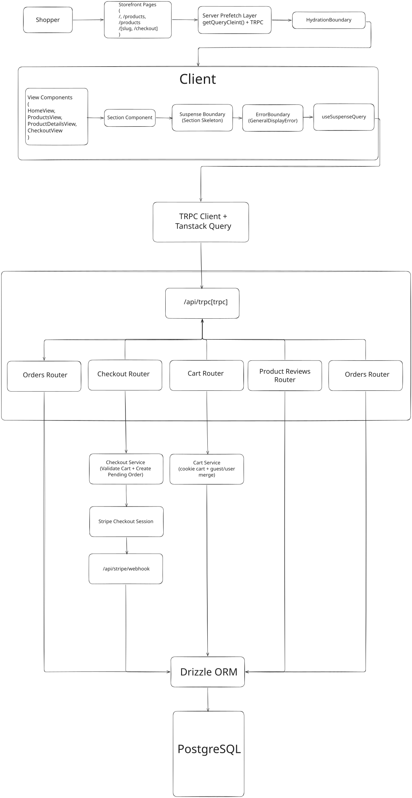

# Next.js E-Commerce Platform

## Overview

This project is a full-stack e-commerce application built with Next.js App Router, tRPC, TanStack Query, Drizzle ORM, and PostgreSQL. The goal is to demonstrate production-style engineering decisions across frontend architecture, API design, data modeling, authentication/authorization, and payment processing. It includes a shopper storefront, a role-protected admin workspace, cart and checkout flows, and Stripe webhook-based order finalization. The codebase is organized by domain modules to keep UI, server logic, and validation cohesive.

## Tech Stack

### Application Framework

- Next.js 16 (App Router)
- React 19
- TypeScript

### UI and Styling

- Tailwind CSS v4
- shadcn/ui
- React Hook Form + Zod resolvers

### API and Data Fetching

- tRPC (end-to-end type-safe API)
- TanStack Query (client cache + hydration)
- superjson (serialization for rich data types)
- nuqs (typed URL query state)

### Database and ORM

- PostgreSQL
- Drizzle ORM
- drizzle-zod

### Authentication and Authorization

- better-auth
- Email/password + Google OAuth
- Role-based access (`user`, `admin`)

### Payments and External Services

- Stripe Checkout + Stripe Webhooks
- Cloudflare R2 (S3-compatible) for product image storage

## Core Features

- Authentication with role-protected route groups and procedures.
- Product catalog with filtering, sorting, pagination, and detail pages.
- Product reviews with authenticated write operations and aggregate rating updates.
- Cart lifecycle for guests and signed-in users, including cart merge on login.
- Optimistic UI cart mutations with rollback and query invalidation.
- Checkout session creation through Stripe and server-side order creation.
- Webhook-driven payment confirmation, order update, and inventory decrement.
- Admin module for catalog management (products, variants, categories, tags, sizes, colors).
- Admin analytics (KPIs, revenue trends, top products, sales by department).

## Architecture Overview

### Storefront Diagram

[Design Diagram](https://excalidraw.com/#json=DwkBqCZzbvUTDImer_NTI,Iv3nZg8vsQ-uTpHCzZyxGQ)


### Project Structure

```text
app/
  (auth)/...
  (products)/...
  (checkout)/...
  (profile)/...
  (admin)/...
  api/
    auth/[...all]/route.ts
    trpc/[trpc]/route.ts
    stripe/webhook/route.ts
modules/
  <domain>/
    domain/   (validation schemas, types)
    server/   (tRPC routers, services)
    ui/       (views, sections, components)
db/
  schema.ts   (Drizzle schema + enums + relations)
  index.ts    (Postgres + Drizzle client)
trpc/
  init.ts
  routers/_app.ts
  client.tsx
  server.tsx
lib/
  auth.ts
  stripe.ts
  r2.ts
  guards.ts
```

### API and Data Flow

The app uses a single tRPC surface (`appRouter`) composed by domain routers (`products`, `cart`, `checkout`, `orders`, `admin`, and `productReviews`). Client components call procedures through `@trpc/tanstack-react-query`, while server components can prefetch through the server proxy and pass dehydrated state to the client.

All business logic is executed server-side in router procedures and service functions. API inputs are validated at the boundary with Zod schemas. Auth context is resolved in `createTRPCContext` using `better-auth`, then enforced with procedure middleware (`publicProcedure`, `protectedProcedure`, `adminProtectedProcedure`).

### Server vs Client Components

- Server components are used for route-level data prefetching and hydration boundaries.
- Client components handle interactivity and mutations (cart operations, reviews, forms).
- This split reduces client JavaScript for read-heavy pages while preserving responsive UX for stateful interactions.

### Suspense and Error Isolation Pattern

This repository uses a consistent render pipeline across domains:

- `app/*/page.tsx` server components prefetch route-critical queries and return a clean view wrapped with `HydrationBoundary`.
- View components stay intentionally thin; they compose sections and layout rather than owning complex data logic.
- Data-owning sections use `useSuspenseQuery` and local `Suspense` fallbacks (skeletons/loading states).
- Sections are wrapped in `react-error-boundary` with `GeneralDisplayError`, so retry/reset can happen without collapsing the whole page.

This gives independent loading and error handling per section while retaining server-prefetch + client hydration performance.

### Caching Strategy

- Query caching is handled with TanStack Query.
- App Router pages prefetch key queries server-side and hydrate on the client to avoid immediate duplicate fetches.
- Cart mutations apply optimistic updates, rollback on error, then invalidate for source-of-truth reconciliation.
- Selected routes are dynamic (`force-dynamic`) where request-time data is required (auth/cart/checkout-sensitive flows).

## Checkout and Order Processing

The checkout flow is designed so payment confirmation is server-trusted, not client-trusted.

1. Client triggers `checkout.createCheckoutSession`.
2. Server resolves the active cart, validates inventory and product state, and computes totals.
3. A pending order and order items are inserted in PostgreSQL before redirect.
4. Stripe Checkout Session is created with `orderId` in metadata.
5. Stripe calls `/api/stripe/webhook` on successful completion.
6. Webhook verifies signature, marks order as paid, stores payment/shipping fields, logs order event, and decrements inventory in a transaction.

This protects against client tampering and ensures paid state is derived from Stripe events rather than browser-side assumptions.

## Database Design

Key modeling decisions:

- Product data is normalized across `products`, `productVariants`, `productImages`, categories/tags, colors, and sizes.
- Variants store purchasable price/inventory state per SKU-level option set.
- Carts and cart items are separated; carts have status lifecycle (`open`, `converted`, `abandoned`).
- Orders and order items persist purchase-time snapshots (`nameSnapshot`, `unitPriceCentsSnapshot`, etc.) so historical order accuracy is independent of future catalog edits.
- Monetary values are stored in integer cents to avoid floating point precision errors.
- Enum-driven states (`order_status`, `payment_provider`, `product_flag`, etc.) constrain domain transitions.
- `orderEvents` provides an audit trail for checkout/payment lifecycle events.

## Auth and Access Control

- `better-auth` persists users/sessions/accounts in PostgreSQL through Drizzle.
- Route-level guards (`requireAuth`, `requireAdmin`) protect page access.
- tRPC middleware enforces role checks at procedure level for defense in depth.
- Admin operations (catalog, media, analytics) are restricted to `admin` role.

## Engineering Tradeoffs

- tRPC over REST:
  - Pros: strict end-to-end typing, lower integration friction, faster refactors.
  - Cons: tighter coupling between frontend/backend TypeScript and fewer language-agnostic integration surfaces.
- Monolithic Next.js app over split services:
  - Pros: simpler deployment and developer velocity for a portfolio-scale product.
  - Cons: scaling teams and independently deployable domains would eventually favor service boundaries.
- Server-rendered prefetch + hydration:
  - Pros: better initial data availability and reduced fetch waterfalls.
  - Cons: requires careful cache key discipline and adds complexity versus pure client fetching.

## Future Improvements

- Add idempotency guards for webhook event processing (e.g., event IDs and duplicate suppression).
- Add automated tests:
  - Unit tests for domain services (checkout totals, cart merge, authorization gates).
  - Integration tests for router procedures and webhook behavior.
  - End-to-end smoke tests for checkout and admin flows.
- Implement admin orders/users management pages (currently scaffolded placeholders).
- Add observability (structured logging, tracing, error monitoring).
- Add CI pipeline for lint/test/build checks.
- Add rate limiting and abuse protections on public endpoints.

## Getting Started

### Prerequisites

- Node.js 20+
- npm
- PostgreSQL database
- Stripe account (test keys + webhook secret)
- Cloudflare R2 bucket/credentials for image uploads
- Google OAuth credentials (optional if you only use email/password auth)

### 1) Install dependencies

```bash
npm install
```

### 2) Configure environment variables

Create a `.env` for runtime values:

```bash
DATABASE_URL=
NEXT_PUBLIC_APP_URL=http://localhost:3000

GOOGLE_CLIENT_ID=
GOOGLE_CLIENT_SECRET=
BETTER_AUTH_SECRET=
BETTER_AUTH_URL=http://localhost:3000

R2_ACCOUNT_ID=
R2_ACCESS_KEY_ID=
R2_SECRET_ACCESS_KEY=
R2_BUCKET=
R2_PUBLIC_BASE_URL=

STRIPE_SECRET_KEY=
STRIPE_WEBHOOK_SECRET=
```

If you use Drizzle CLI commands, this repo's `drizzle.config.ts` loads `.env.development` by default, so either:

- create `.env.development` with `DATABASE_URL`, or
- run Drizzle with `NODE_ENV` set to a matching env file suffix.

### 3) Apply database migrations

```bash
npx drizzle-kit push
```

### 4) Run the app

```bash
npm run dev
```

Then open `http://localhost:3000`.

### 5) (Optional) Listen for Stripe webhooks locally

Use Stripe CLI to forward events to:
`http://localhost:3000/api/stripe/webhook`

## Scripts

- `npm run dev` - start local development server.
- `npm run build` - production build.
- `npm run start` - run production server.
- `npm run lint` - lint codebase.
